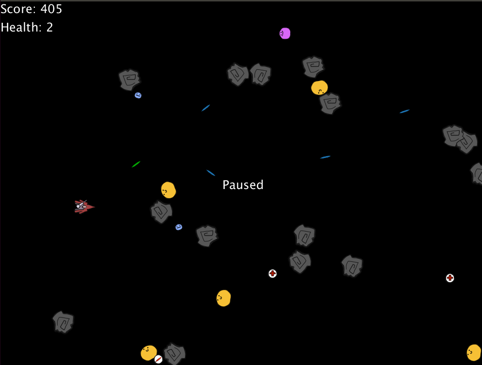

# Top Down Shooter 



## About
A top down shooter that involves navigating an asteroid field and shooting 
a variety of enemies with the help of various power-ups.

Boost the spaceship forward with `w` and steer it with `a` and `d`.
Shoot lasers towards the cursor with left click (can be held). The 
camera can be zoomed in and out with `i` and `o`.  Destroy enemies 
to gain score. Coming into contact with an enemy will damage your
ship. When your health reaches zero the game is over.

### Enemies


Enemies from left to right: Random, Chaser, Flocker, Ghost.
Each enemy has unique behaviour:
* Random: Traverses randomly.
* Chaser: Uses A\* path finding to navigate the asteroid field and chase the spaceship.
* Flocker: Uses A\* path finding to navigate to the nearest Chaser and flocks around it.
* Ghost: Moves in a straight line across the screen ignoring collision.

### Power-ups


Power-ups from left to right: Health, Rapid Fire, Penetrating, Reflect.
Power-ups can be picked up by moving the ship over them. Each power-up
gives a different benefit.
* Health: Restores one health.
* Rapid Fire: Temporarily increases fire rate.
* Penetrating: Temporarily causes lasers to penetrate enemies and asteroids.
* Reflect: Temporarily causes lasers to bounce off enemies and asteroids.


### Dynamic Difficulty
The game's difficulty is adjusted dynamically to attempt to match the player's
performance. This adjusts power-up and enemy spawn rate with a scheme inspired 
by TCP congestion control.

## Building and Running
The game can be compiled and run with:

```
ant
```

## Documentation
Doxygen documentation can be generated with:

```
ant -lib lib doxygen
```

The resulting documentation can be found in the `docs` directory.
